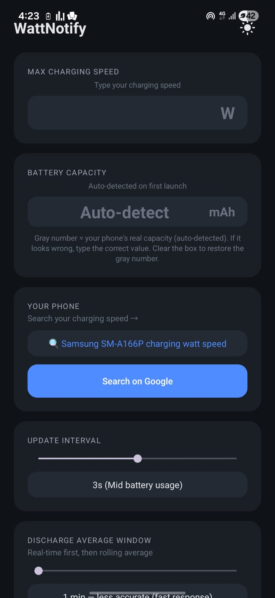
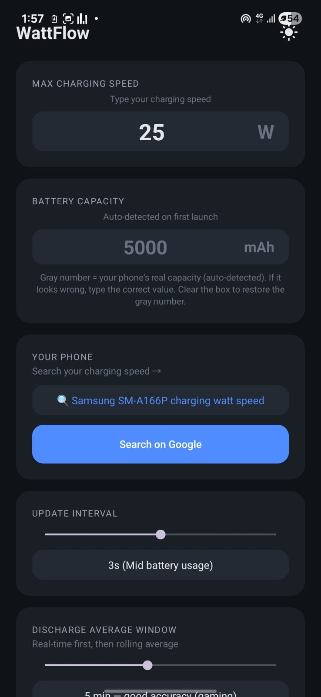
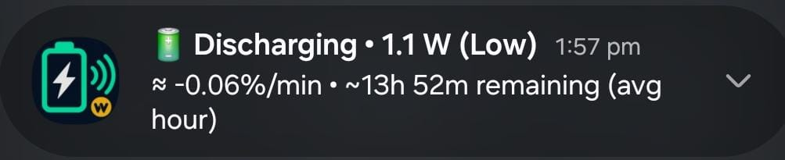

# WattNotify


A lightweight Android battery charging monitor that shows live wattage, speed classification, and time estimates in a persistent notification.

Built to be genuinely small: ~15 MB RAM, <1% CPU, ~5–6.5 MB APK. No ads, no tracking, no cloud, no account.

---

## Features

- **Live wattage** in the notification (Voltage × Current)
- **Charging speed classification** — Very Slow / Slow / Normal / Fast / Super Fast, based on your phone's max wattage
- **Discharging speed classification** — Very Low / Low / Normal / High / Very High, based on real-world measured power draw
- **Time to full / time remaining** — calculated from live wattage, not the phone's built-in (often inaccurate) estimate
- **Rolling average window** — after a configurable period, the estimate switches from real-time to a stable rolling average so the number stops jumping
- **Auto battery capacity detection** — reads the fuel gauge on first launch and adapts calculations to your phone's real battery size
- **Manual capacity override** — correct the detected value if needed; auto-detected value stays as a gray hint
- **Dark / light mode** — native Android resource switching, no restart lag
- **Adjustable tick rate** — 1s to 5s, with usage warnings for each option
- **No root, no ADB, no special permissions** — uses only public Android APIs

---

## Why this exists

Most battery monitoring apps either:

- Show numbers that don't match reality (because Android's `CURRENT_NOW` API is unreliable on many devices)
- Are bloated with ads, analytics, and cloud sync (DevCheck is 80–150 MB RAM)

WattNotify solves both:

1. **Accurate wattage** — works around Samsung/MediaTek restrictions by reading from the correct fuel-gauge properties, not the broken `CURRENT_NOW` sensor
2. **Genuinely lightweight** — no AndroidX Material, no animations, no graphs, no network

---

## Screenshots

| Light mode | Dark mode | Notification |
|:---:|:---:|:---:|
|  |  |  |

---

## Installation

### For users (install the APK)

1. Download the latest APK from the [Releases](../../releases) page
2. On your phone, enable **Install unknown apps** for your browser or file manager
3. Tap the APK → **Install**
4. Open WattNotify → enter your phone's max charging speed → tap **Start Monitoring**

### For developers (build from source)

**Requirements:**
- Android Studio (any recent version)
- Android SDK 34 (compile SDK)
- Kotlin 1.9+

**Steps:**
1. Clone the repo
2. Open in Android Studio
3. Build → Build Bundle(s) / APK(s) → Build APK(s)

**Signed release APK:**
1. Build → Generate Signed Bundle / APK → APK
2. Create a new keystore (or use an existing one)
3. Choose **release** build variant
4. The APK will be at `app/build/outputs/apk/release/app-release.apk`

---

## How it works

### Live wattage

The app reads two values every tick (1–5 seconds):

```
Voltage    → BatteryManager.EXTRA_VOLTAGE     (millivolts)
Current    → BatteryManager.BATTERY_PROPERTY_CURRENT_NOW  (microamps)
```

Then:

```
Watts = (voltage_mV × current_µA) / 1,000,000,000
```

### Speed classification

**Charging** — proportional to the user's max wattage:

| Ratio | Label |
|---|---|
| < 10% | Very Slow |
| < 30% | Slow |
| < 55% | Normal |
| < 80% | Fast |
| ≥ 80% | Super Fast |

**Discharging** — absolute watts (verified against real measurements):

| Watts | Label |
|---|---|
| < 0.5 W | Very Low |
| < 1.5 W | Low |
| < 3.0 W | Normal |
| < 5.0 W | High |
| ≥ 5.0 W | Very High |

### Time estimates

**Real-time** (first window, and whole charging session):

```
current_mA  = (watts × 1,000,000) / voltage_mV
rate_%/min  = (current_mA / battery_capacity_mAh) × 100 / 60
time        = remaining_% / |rate_%/min|
```

**Rolling average** (after the discharge window ends):

- Keeps a sliding window of power samples (1–10 minutes, user-configurable)
- Recalculates the average **once per window**, then locks the display until the next boundary
- The number does not move between boundaries, even if the live wattage changes
- When a new window completes, old samples drop out and the average updates

### Battery capacity detection

On first launch, the app reads `BATTERY_PROPERTY_CHARGE_COUNTER` (real remaining charge in µAh) and the battery percentage, then:

```
capacity_mAh = (counter_µAh / 1000) / (percent / 100)
```

This runs **once**, only when the battery is between 20% and 80% (where the fuel gauge is most accurate). The result is saved to `SharedPreferences` and reused forever.

If the user types their own capacity, that value overrides the auto-detected one. Clearing the box restores the auto-detected value.

---

## Device compatibility

### Samsung / MediaTek (tested on Galaxy A16 5G, Android 16)

On these devices, the public `CURRENT_NOW` sensor returns incorrect values while charging. WattNotify handles this by:

- Reading `CHARGE_COUNTER` (µAh) for capacity detection
- Using the reliable `CURRENT_NOW` value during discharge
- Falling back to voltage-based estimation when needed

No root, no ADB, no SELinux workaround — just correct usage of Android's public APIs.

### Other devices

Works on any Android 8.0+ phone. The wattage math, capacity detection, and speed classification all scale automatically.

---

## Architecture

```
MainActivity.kt       UI, onboarding, settings persistence
BatteryService.kt     Foreground service, sensor reads, all math, notification
```

Both files are self-contained. No other classes, no DI, no ViewModels, no libraries beyond `androidx.core` (for `NotificationCompat`).

### Data flow

```
BatteryManager sensor
        │
        ▼
  voltageMv + currentUa
        │
        ▼
   computeWatts()  ─────►  buildNotification()  ─────►  Notification
        │                                                    ▲
        ▼                                                    │
  powerSamples (60-item rolling buffer)                      │
        │                                                    │
        ▼                                                    │
  estimateFromAveragePower()  ─── real-time estimate ────────┘
        │
        ▼
  dischargePowerSamples (windowed, timestamped)
        │
        ▼
  estimateFromDischargeAverage()  ─── locked average ──────►  Notification
```

---

## Performance

| Metric | Value |
|---|---|
| APK size | ~5–6.5 MB |
| RAM (service running) | ~12–20 MB |
| RAM (app open) | ~18–25 MB |
| CPU at 3s tick | ~0.2% |
| CPU at 1s tick | ~0.7–1.0% |
| Battery drain (3s, idle) | ~0.8–1.5% per hour or less |


---

## Limitations

Honest limitations:

- **Cannot predict future discharge rate** — it measures the *current* rate and extrapolates. Open a game and the number drops; close it and the number recovers after the window passes. That's physics.
- **Cannot read charger-side wattage** — Android doesn't expose USB-PD negotiation. The wattage shown is battery-side (what the battery actually receives), which is always slightly lower than wall output due to conversion losses.
- **Numbers may differ from your phone's built-in estimate** — Samsung, Google, and Xiaomi all use their own internal algorithms. WattNotify uses pure watt-based math, so numbers won't match exactly.
- **No ads, no analytics, no accounts** — this is not a monetization project.

---

## Contributing

Issues and pull requests are welcome.

- Found a bug? [Open an issue](../../issues) with your phone model, Android version, and a screenshot if possible
- Want to add a feature? Fork the repo, make your changes, and open a PR
- Tested on a phone not listed above? Share your results in the issues

---

## License

MIT License — see [LICENSE](LICENSE) for details.

### Attribution is required

If you use, fork, or distribute this project (or any part of it), you **must**:

- Keep this `README.md` and the `LICENSE` file in your copy
- Give clear credit to the original author in your repository, website, or app's about screen
- Include a link back to this repository: `https://github.com/SilentStrangerX/WattNotify`

Example credit line:

> Based on [WattNotify](https://github.com/SilentStrangerX/WattNotify) by **@SilentStrangerX**.

Removing the author's name or claiming the work as your own is **not permitted**.

---

## Author

**@SilentStrangerX**
GitHub: [SilentStrangerX](https://github.com/SilentStrangerX)

Creator and maintainer of WattNotify.
Designed the architecture, wrote the Samsung/MediaTek workaround, and built the rolling-average lock logic.

- Found a bug? [Open an issue](https://github.com/SilentStrangerX/WattNotify/issues)
- Want to contribute? Open a pull request
- Want to use this in your own project? See the License section above — attribution is required